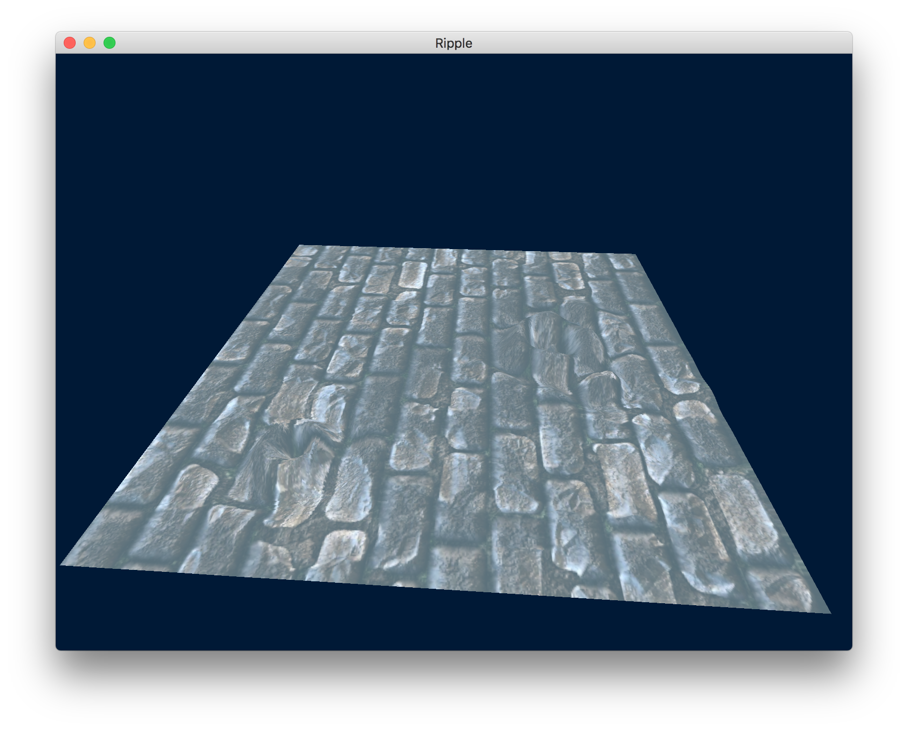

# Notes on data-parallel programming with Metal

(Corresponds to Chapter 7 of _Seven Concurrency Models in Seven Weeks_)

## Day 1: GPGPU Programming

### Optimization

> Your task as a programmer is to divide your problem into the smallest work-items you can.

Butcher notes that this is a simplification, but it is indeed a good rule of thumb to start with. Invoking a kernel function has a small but non-zero overhead, so if the work done by the function is truly trivial, you might want to "unroll" multiple invocations into the function body, dispatching a smaller grid. On the other hand, if you unroll too much, your "register pressure" will reach a point where the fewer kernel invocations can be issued to each shader core, reducing _occupancy_ (a measure of the parallel work that the GPU can perform at a given time).

### Overview of Data-Parallel Programming in Metal

The basic steps of writing a data-parallel program are as follows:

1. Create a Metal device (`MTLDevice`). This is the programmatic interface to the GPU
1. Create a command queue (`MTLCommandQueue), which manages lists of commands ("command buffers" to be executed by the GPU
1. Create a compute pipeline state object (`MTLComputePipelineState`) from your kernel function source (this entails creating a Metal library (`MTLLibrary`) and a Metal function object (`MTLFunction`) for each compute pipeline).
1. Create buffers that store the data to be operated on by the kernel function
1. For each computation or frame:
	 1. Create a command buffer, into which commands will be written (_encoded_)
	 1. Create a command encoder (`MTLComputeCommandEncoder`)
	 1. Configure the command encoder with your resources (buffers) and pipeline state object
	 1. Dispatch a "grid" of work, which is a 1-, 2- or 3-dimensional set of numbers that indicates how many times the kernel should be invoked.
	 1. End encoding on the encoder, and commit the command buffer, which signals that it is ready to be scheduled and executed on the GPU.

### Multiplying Arrays

Kernel function:

	kernel void multiply_arrays(device float *inputA [[buffer(0)]],
	                            device float *inputB [[buffer(1)]],
	                            device float *output [[buffer(2)]],
	                            uint tpig [[thread_position_in_grid]])
	{
	    output[tpig] = inputA[tpig] * inputB[tpig];
	}

Note that we attribute one of the parameters with `thread_position_in_grid`; each time the kernel is invoked (once per grid item), this parameter tells is "where" we are in the grid, which in this case just means the index of the array we're currently operating on.

Dispatching the work:

    let threadExecutionWidth = computePipeline.threadExecutionWidth
    let threadsPerGrid = MTLSizeMake(ArraySize, 1, 1)
    let threadsPerThreadgroup = MTLSizeMake(min(threadExecutionWidth, ArraySize), 1, 1)
    let threadgroupsPerGrid = MTLSizeMake(threadsPerGrid.width / threadsPerThreadgroup.width, 1, 1)
    commandEncoder.dispatchThreadgroups(threadgroupsPerGrid, threadsPerThreadgroup: threadsPerThreadgroup)

Here, we're manually computing how we want the grid to be broken up. The product of `threadsPerThreadgroup` and `threadgroupsPerGrid` determines how big the grid is. We select `threadsPerThreadgroup` to be a small multiple of the `threadExecutionWidth` of the pipeline when possible, since this is the number of simultaneous kernel invocations that can be launched efficiently on the GPU. The number of threadgroups to be launched is the total number of kernel invocations in the grid (i.e., number of array elements to be multiplied), divided by the threadgroup size.

### Resources

[Metal Documentation](https://developer.apple.com/documentation/metal)
[Metal Shading Language Specification](https://developer.apple.com/metal/Metal-Shading-Language-Specification.pdf)

## Day 2: Multiple Dimensions and Workgroups

Kernel function:

    kernel void multiply_matrices(constant float *inputA    [[buffer(0)]],
                                  constant float *inputB    [[buffer(1)]],
                                  device float *output      [[buffer(2)]],
                                  constant MatrixDims &dims [[buffer(3)]],
                                  uint2 tpig                [[thread_position_in_grid]])
    {
        uint i = tpig.x;
        uint j = tpig.y;
        float sum = 0;
        for (uint k = 0; k < dims.inputAColumns; ++k) {
            float a = inputA[k * dims.outputColumns + j];
            float b = inputB[i * dims.inputAColumns + k];
            sum = sum + (a * b);
        }
        output[i * dims.outputRows + j] = sum;
    }

This function effectively implements a "dot product" between one row of the left matrix and one column of the right matrix. The resulting sum is the written to the appropriate element of the result matrix. Note that, this time, we have a 2-D `thread_position_in_grid` parameter; this is the output element index in (column, row) order. This kernel function will be invoked once per result element. 

Dispatching the matrix multiplication:

    let threadsPerGrid = MTLSizeMake(OuterDim, OuterDim, 1) // size of result matrix
    let threadsPerThreadgroup = MTLSizeMake(16, 16, 1)
    commandEncoder.dispatchThreads(threadsPerGrid, threadsPerThreadgroup: threadsPerThreadgroup)

Here, we somewhat arbitrarily select a threadgroup size of 256 (16x16) and let Metal figure out exactly how split up the grid. This takes advantage of a new API in iOS 11/macOS 10.13: `dispatchThreads(_, threadsPerThreadgroup:)`. 

## Day 3: Keeping it on the GPU

### Interoperation between kernel functions and rendering

By using an analytic, closed-form equation for the ripple, we keep this sample "embarrassingly parallel": the displacement of each vertex is the sum of the wave equations that affect it, unaffected by adjacent vertices. To update the vertex positions, we dispatch a compute kernel against the vertex buffer of the water mesh, then just draw the mesh with Metal. The command queue automatically infers the data dependency between the kernel function and the draw call and ensures that the compute command completes before the drawing starts.

We don't need to triple-buffer or otherwise protect against simultaneous access by the CPU and GPU because we never read the vertex buffer back to the CPU. On the other hand, we normally would need to protect against simultaneous access when writing uniform data (such as the modelview and projection matrices), since we write these on the CPU every frame.

We skirt this by using a facility provided by Metal: the `setVertexBytes(_, length:, index:)` method. This method causes Metal to create a buffer behind the scenes and coordinate synchronization for us. It's a great way to get small amounts of data (a few KiB) onto the GPU without a hassle.

### Screenshot

